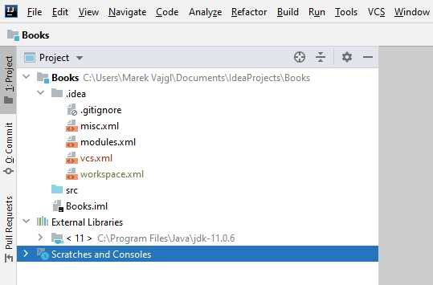
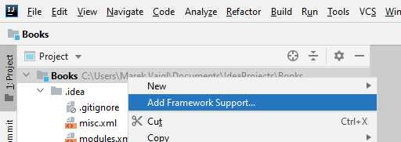

# 1 Vytvoření projektu v Idea

## Předpoklady

Předpokládáme nainstalované prostředí Idea, nainstalovanou Javu - JDK verzi 11 a vyšší. Dále se předpokládá nainstalovaný a do Idea připojený webový server Jetty.

## 1 Vytvoření nového projektu

Spustíme prostředí Idea a vytvoříme nový projekt:

1. Vybereme File =&gt; New =&gt; Project.
2. Zvolíme projekt čistá "Java", nepřidáváme další knihovny.
3. Proklikáme beze změn průvodce až na stranu, kde se zadává název projektu.
4. Zadáme název projektu "Books" a potvrdíme vytvoření.

Nyní byl vytvořen prázdný projekt. V projektu nejsou žádné obsahové soubory \(jen soubory Idea popisující projekt\) a projekt nelze spustit.

## 2 Převedení projektu na webový projekt

Dalším krokem je převedení projektu na webový projekt:

1. Nad projektem **Books** otevřeme kontextové menu a vybereme položku "Add Framework Support" \(viz obrázek níže\).
2. Vybereme položku "Java EE =&gt; Web Application" a volbu potvrdíme ok. V projektu se nám vytvoří složky "src" a "web", ve druhé jmenované se objeví výchozí soubor `index.jsp`.
3. Přidáme konfiguraci pro spuštění:
   1. Vybereme menu "Run =&gt; Edit Configurations".
   2. V otevřeném dialogu vybereme "+ =&gt; Jetty Server =&gt; Local" \(první volbou je rozbalení tlačítka se symbolem plus +\).
   3. V dolní části okna opravíme chybu "**Warning:** No artifacts marked for deployment" stisknutím tlačítka "Fix". Stisk nás přenese na záložku "Deployment", vrátíme se zpátky na záložku "Server".
   4. \(Volitelné\) Je vhodné zvolit "On 'Update' Action" na "Update classes and resources", protože to bude volba, kterou budeme nejčastěji používat.
   5. Potvrdíme dialog ok.
4. Spustíme webovou aplikaci. Mělo by se otevřít okno prohlížeče s obsahem prázdné stránky a nápisem $END$.

## 3 Přidání podpory _Maven_

Nad projektem opět otevřeme kontextové menu a vybereme "Add Framework Support". Nalezneme a zvolíme položku "Maven" a potvrdíme. Do projektu přibude soubor `pom.xml`.


_Maven_ je nástroj, který nám umožní lepší správu a práci s projektem. V našem případě ulehčí přidávání závislostí a knihoven, které bychom jinak museli řešit sami a ručně.


_Maven_ využívá konfigurační soubor `pom.xml`k upřesnění konfigurace a obsahu projektu. Do tohoto souboru budeme dopisovat informace. Aby _Maven_ věděl, kdy je má použít, synchronizace obsahu s projektem se provádí ručně na vyžádání. V Idea napravo nalezneme nyní záložku "Maven", po jejím rozbalení je hned první ikonka se symbolem obnovení \(dvě šipky v kruhu - "Reload all Maven projects"\). Stiskem ikonky se provede synchronizace a úprava projektu v Idea tak, aby odpovídal konfiguraci v `pom.xml`. Vždy, když provedeme změnu v tomto souboru, musíme provést toto obnovení. Obnovení někdy může chvilku trvat, protože Maven přitom může stahovat požadované závislosti z internetu.

Po uložení zkusíme projekt spustit, abychom se ujistili, že vše probíhá v pořádku.

\_\_

