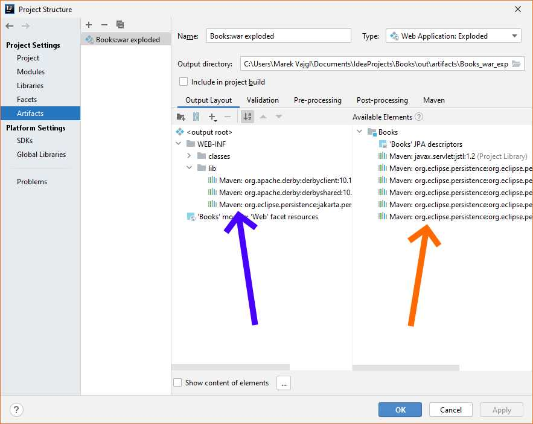
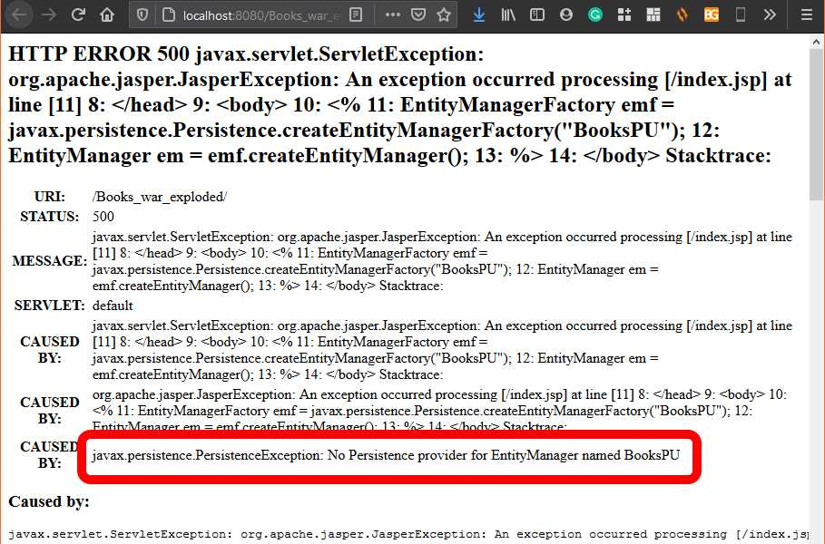
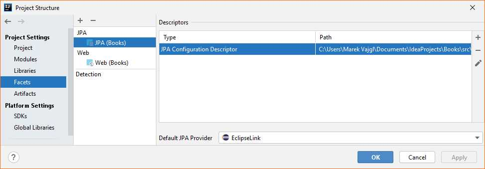
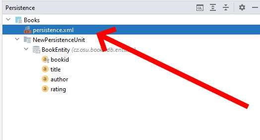

# 2 Vytvoření a připojení databáze do projektu

## Předpoklady

Předpokládá se nainstalovaná Idea, připojená k serveru Jetty, vytvořený projekt z předchozí kapitoly. Dále se předpokládá nainstalovaný a **spuštěný** databázový server Apache Derby na lokálním počítači \(localhost:1527, v opačném případě je třeba adekvátně změnit připojovací kód k databázi\). 

Předpokládá se znalost připojení databáze do prostředí Idea a znalost práce s touto databází přes konzoli Idea.

## 1 Vytvoření databáze pro projekt

Prvním krokem bude vytvoření databáze. Do Idea připojíme a vytvoříme databází "BooksDB" \(viz postup v tutorialech v předpokladech\), ve stručnosti:

1. Otevřeme podokno Idey "Database".
2. V okně přidáme nové připojení pro server "Apache Derby"
3. V otevřeném okně změníme typ připojení z "Embedded driver" na "Remote driver".
4. Připojíme se na server "localhost", port 1527, uživatelské jméno "sa", heslo libovolné vlastní \(důležité si jej zapamatovat!\), název databáze "BooksDB".
5. Otestujeme připojení a okno uzavřeme. Otevře se konzolové okno pro příkazy SQL.

Vytvoříme jednoduchou tabulku v databázi. Budeme využívat autoinkrementální primární klíč - tj. databáze si sama bude do primárního klíče přirazovat hodnoty pro nově vytvořené záznamy. Vložíme následující kód a spustíme jej:

```sql
create table Book(
        BookId int primary key generated always as identity,
        Title varchar(64) not null,
        Author varchar(256) not null,
        Rating float not null
);
```

Po vytvoření by se nám v prostředí Idea měla v databázovém okně v daném připojení ukázat vytvořená databázová tabulka:


Pomocí SQL do tabulky vložíme nějaká data a necháme si je vypsat/zobrazit:

```sql
insert into Book(Title, Author, Rating)
    values ('MayDay', 'Thomas H. Block', 4.3);
insert into Book(Title, Author, Rating)
    values ('Martian', 'Andy Weir', 4.7);
insert into Book(Title, Author, Rating)
    values ('Neuromancer', 'William Gibson', 3.2);

select * from Book
```


Všimněme si, že v SQL explicitně řikáme, do kterých sloupců chceme data vložit. Je to proto, že nemůžeme \(jednoduše\) vkládat data do sloupce `BookId`, který je nastavován automaticky. Nemůžeme proto použít jednodušší zápis `insert into Book values (...)`.



## 2 Připojení DB do webového projektu

Pro připojení do databáze budeme ve webovém projektu využívat knihovn EclipseLink \([https://www.eclipse.org/eclipselink/\#jpa](https://www.eclipse.org/eclipselink/#jpa)\). Pro připojení JPA do projektu využijeme Maven. 

### 2.1 Připojení ovladače databáze

Nejdříve připojíme ovladač databáze - ten je nutný, aby se aplikace uměla s databází domluvit:

1. Otevřeme web Maven Repository \([https://mvnrepository.com/](https://mvnrepository.com/)\) a necháme vyhledat "Apache Derby JDBC":
2. Vybereme položku "Apache Derby Client JDBC Driver" \([https://mvnrepository.com/artifact/org.apache.derby/derbyclient](https://mvnrepository.com/artifact/org.apache.derby/derbyclient)\) a požadovanou verzi podle databáze.
3. Zkopírujeme a přidáme do  `pom.xml` do bloku `<dependencies>` požadovanou knihovnu. Stejný postup opakujeme pro "Apache Derby Tools". Výsledný vkládaný obsah:

```markup
<!-- https://mvnrepository.com/artifact/org.apache.derby/derbyclient -->
<dependency>
    <groupId>org.apache.derby</groupId>
    <artifactId>derbyclient</artifactId>
    <version>10.15.2.0</version>
</dependency>

<!-- https://mvnrepository.com/artifact/org.apache.derby/derbytools -->
<dependency>
    <groupId>org.apache.derby</groupId>
    <artifactId>derbytools</artifactId>
    <version>10.15.2.0</version>
</dependency>
```

Obnovíme Maven, který stáhne požadované ovladače do projektu.


Jednotlivé závislosti - bloky `dependency` - vkládáme za sebou, nepřepisujeme je. Všechny bloky vkládáme dovnitř do bloku `dependencies`.



Po vložení nové závislosti by měl kód závislosti zčervenat - to znamená, že projekt sám ještě danou knihovnu nezná. Až obnovením Mavenu tento stáhne požadované knihovny do projektu a červená barva zmizí.


### 2.2 Připojení knihovny JPA - EclipseLink

Následně připojíme ovladač persistence - ten nabízí jednoduché metody pro načítání a ukládání objektů do databáze bez využití SQL:

1. Otevřeme web Maven Repository \([https://mvnrepository.com/](https://mvnrepository.com/)\) a necháme vyhledat "EclipseLink JPA".
2. Vybereme položku "EclipseLink JPA" \([https://mvnrepository.com/artifact/org.eclipse.persistence/org.eclipse.persistence.jpa](https://mvnrepository.com/artifact/org.eclipse.persistence/org.eclipse.persistence.jpa)\) a požadovanou verzi \(v našem případě 2.7.0\).
3. Zkopírujeme a přidáme do `pom.xml` do bloku `<dependencies>` požadovanou knihovnu:

```markup
<!-- https://mvnrepository.com/artifact/org.eclipse.persistence/org.eclipse.persistence.jpa -->
<dependency>
    <groupId>org.eclipse.persistence</groupId>
    <artifactId>org.eclipse.persistence.jpa</artifactId>
    <version>2.7.7</version>
</dependency>

```

Obnovíme Maven, který stáhne požadované ovladače do projektu.

Připojením knihovny "EclipseLink JPA" se zároveň v projektu aktivuje podpora tzv. Persistence.


Pokud by se tak nestalo, nebo bychom chtěli podporu perzistence aktivovat v projektu ručně, využijeme opět kontextové menu nad projektem "Books =&gt; Add Framework Support" a vybereme "JPA Persistence".


Výsledný aktuální obsah soubor `pom.xml`:


```markup
<?xml version="1.0" encoding="UTF-8"?>
<project xmlns="http://maven.apache.org/POM/4.0.0"
         xmlns:xsi="http://www.w3.org/2001/XMLSchema-instance"
         xsi:schemaLocation="http://maven.apache.org/POM/4.0.0 http://maven.apache.org/xsd/maven-4.0.0.xsd">
    <modelVersion>4.0.0</modelVersion>

    <groupId>groupId</groupId>
    <artifactId>Books</artifactId>
    <version>1.0-SNAPSHOT</version>

    <properties>
        <maven.compiler.source>1.11</maven.compiler.source>
        <maven.compiler.target>1.11</maven.compiler.target>
    </properties>

    <dependencies>
        <!-- https://mvnrepository.com/artifact/javax.servlet/jstl -->
        <dependency>
            <groupId>javax.servlet</groupId>
            <artifactId>jstl</artifactId>
            <version>1.2</version>
        </dependency>

        <!-- https://mvnrepository.com/artifact/org.apache.derby/derbyclient -->
        <dependency>
            <groupId>org.apache.derby</groupId>
            <artifactId>derbyclient</artifactId>
            <version>10.15.2.0</version>
        </dependency>

        <!-- https://mvnrepository.com/artifact/org.apache.derby/derbytools -->
        <dependency>
            <groupId>org.apache.derby</groupId>
            <artifactId>derbytools</artifactId>
            <version>10.15.2.0</version>
        </dependency>

        <!-- https://mvnrepository.com/artifact/org.eclipse.persistence/org.eclipse.persistence.jpa -->
        <dependency>
            <groupId>org.eclipse.persistence</groupId>
            <artifactId>org.eclipse.persistence.jpa</artifactId>
            <version>2.7.7</version>
        </dependency>
    </dependencies>

</project>
```


### 2.3 Připojení knihoven do výsledného artefaktu


Problematika v této pasáži je platná obecně a nemusí se vztahovat jen k problematice připojení k databázi, ale je platná pro libovolnou knihovnu, která je přiložena do projektu.


Maven automaticky připojuje požadované závislosti/knihovny do projektu, ale automaticky se nepřidávají do výstupního artefaktu - balíčku, který se nasazuje na server a je spouštěn. Některé knihovny však musí být k dispozici i za běhu projektu, jinak program spadne s chybou - typicky s výjimkou " `ClassNotFoundException` nebo `NoClassDefFoundError`. Řešením je přidat požadované knihovny \(.jar soubory\) do výstupního artefaktu.

Popis výstupního artefaktu nalezneme v nastavení projektu - otevřeme kontextové menu nad projektem a zvolíme volbu "Open Module Settings" \(klávesová zkratka F4\). V otevřeném dialogu vybereme položku "Artifact".



Na výše uvedeném obrázku fialová šipka ukazuje oblast, kde jsou pložky, které jsou už umístěny **ve** výstupním artefaktu. Knihovny se umisťují do složky `WEB-INF\lib`. Oranžová šipka ukazuje na artefakty, které jsou v projektu dostupné ke vložení do výstupního artefaktu, a tedy ještě **nejsou** jeho součástí. Položky přetahujeme jednoduše myší pomocí "drag & drop".

Pro připojení k DB pomocí JPA persistence potřebujeme ve výchozím artefaktu všechny knihovny vyjma JSTL 1.2.


Pokud realizujete nějaký jednoduchý testovací projekt, máte chybu s načítáním tříd a nechcete řešit, které knihovny musí být ve výstupním artefaktu dostupné, není velkou chybou tam dát všechny, které využíváte. V produkčním prostředí se pak samozřejmě dávají pouze ty, které jsou nutné, aby se zbytečně nezvyšovala velikost instalovaného produktu.


Následuje velmi jednoduché a rychlé ověření, zda systém persistence funguje. Upravíme soubor `index.jsp`do následující podoby:


```markup
<%@ page import="javax.persistence.EntityManagerFactory" %>
<%@ page import="javax.persistence.EntityManager" %>
<%@ page contentType="text/html;charset=UTF-8" language="java" %>
<%@ taglib prefix="c" uri="http://java.sun.com/jsp/jstl/core" %>
<html>
  <head>
    <title>$Title$</title>
  </head>
  <body>
  <%
    EntityManagerFactory emf = 
      javax.persistence.Persistence.createEntityManagerFactory("BooksPU");
    EntityManager em = emf.createEntityManager();
  %>
  </body>
</html>
```


Projekt po spuštění musí hlásit chybu "javax.persistence.PersistenceException: No Persistence provider for EntityManager named BooksPU". Tato chyba znamená, že se podařilo úspěšně načíst třídu `EntityManagerFactory`.



### 2.4 Nastavení persistence ve webovém projektu

Prvním krokem je aktivace modulu persistence ve webovém projektu, která však již proběhla na konci předchozího bodu. Že je modul aktivován se pozná podle menu "Persistence" v levém svislém sloupci prostředí Idea. Klikem na tuto záložku se otevře podokno Persistence, kde je uvedeno \(zatím prázdné\) nastavení persistence v projektu.



Do okna persistence se lze také dostat přes menu "View =&gt; Tool Windows =&gt; Persistence".


#### 2.4.1 Generování entit

Dalším krokem bude vytvoření tzv "entit" - tříd, které reprezentují záznamy databázových tabulek. V našem případě potřebujeme entitu pro tabulku "Book". Entity si můžeme napsat sami ručně, nebo si je nechat vygenerovat. Pro generování zvolíme v okně Persistence nad libovolnou položkou kontextové menu a vybereme "Generate Persistence Mapping =&gt; By Database Schema".


V otevřeném dialogovém okně nastavujeme, jak a dle čeho se mají entity generovat. Nastavíme:

* Choose Data Source - vybereme datový zdroj pro připojení do databáze. Tento datový zdroj musí být zavedený v prostředí idea \(v Idea vpravo v záložce "Database"\).
* Package - název balíčku, do kterého se budou entity/třídy generovat. Například `cz.osu.books.db.entities`.
* Entity prefix/suffix udává před/příponu, která se bude přidávat před/za název třídy odvozené z názvu tabulky. Naše tabulka `Books`bude tedy reprezentována třídou `BooksEntity`.
* V "Database Schema Mapping" zaškrteneme požadované tabulky - po nás tedy tabulku "Books".
* Dole necháme ještě zaškrtnutou položku "Generate JPA Annotations" - v dřívějších verzích Javy se potřebné anotace \(tj. informace co odkud z DB se načítá ze které tabulky/sloupce\) ukládalo do externího XML souboru. Aktuálně je vhodnější mít tyto anotace přímo v kódu třídy.


Následně dialog potvrdíme. Po potvrzení, zda chceme opravdu provést generování se nás Idea ještě může zeptat, zda chceme třídy uložit do sekce "src/main" - zdrojové kódy, nebo "src/test" pro testování. Vybíráme `src/main/...`. Po potvrzení se:

* v okně Persistence objeví informace o entitě BookEntity,
* ve složce `src/main/java/cz.osu.books.db.entities`objeví soubor s třídou BookEntity.


Generátor v Idea **neumí** vygenerovat Entitu korektně v případě, že obsahuje automaticky generované sloupce - v našem případě primární klíč. V tom případě je třeba informaci, že tento sloupec je generován automaticky, dopsat ručně, viz níže. Pokud v budoucnu entity přegenerujeme, tato informace se ztratí a musí být opět dopsána ručně!


Najdeme třídu/soubor `BookEntity.java` a nalezneme "get..." metodu pro získání id, `getBookid()`. Doplníme k ní atribut říkající, že sloupec je generován automaticky.

```java
@Id
@GeneratedValue(strategy = GenerationType.IDENTITY) // <== tento řádek
@Column(name = "BOOKID")
public int getBookid() {
    return bookid;
}
```

#### 2.4.2 Vytvoření persistentní jednotky

Dalším krokem je vytvoření persistentní jednotky - XML souboru, který definuje, jakým způsobem se bude do webová aplikace připojovat do databáze.


Některé postupy generování kódu v Idea způsobí, že se potřebný soubor `persistence.xml` v projektu vytvoří sám automaticky. Postup přes Maven toto bohužel neumí, a proto jej do projektu musíme přidat ručně.


V projektu nalezneme cestu `Books\src\main\resources`, vytvoříme v ní složku `META-INF` a do ní vložíme nový soubor \(kontextové menu nad složkou, menu "New =&gt; File"\) `persistence.xml`. Daný soubor bude prázdný, proto do něj vložíme výchozí obsah pro EclipseLink JPA připojení:


```markup
<?xml version="1.0" encoding="UTF-8"?>
<persistence xmlns="http://java.sun.com/xml/ns/persistence" version="2.0">

    <persistence-unit name="NewPersistenceUnit">
        <provider>org.eclipse.persistence.jpa.PersistenceProvider</provider>
        <exclude-unlisted-classes>false</exclude-unlisted-classes>
        <properties>
            <property name="eclipselink.jdbc.url" value=""/>
            <property name="eclipselink.jdbc.driver" value=""/>
            <property name="eclipselink.jdbc.user" value=""/>
            <property name="eclipselink.jdbc.password" value=""/>
        </properties>
    </persistence-unit>
</persistence>
```


Dalším krokem bude připojení tohoto souboru jako persistentní jednotky do projektu - projekt tak bude vědět, že tento soubor má brát v potaz. Otevřeme znovu vlastnosti projektu \(F4 nad projektem, nebo kontextové menu nad projektem, "Open Module Settings"\), vybereme položku "Facets", označíme pod-položku "JPA". Napravo v okně vybereme tlačítko "+ =&gt; persistence.xml" a vybereme námi vytvořený soubor. 



Po potvrzení dialogu se soubor objeví v okně "Persistence".



Nyní musíme soubor upravit tak, aby byl nastaven na naše připojení k databázi. V souboru definujeme:

* persistence-unit name -  název persistentní jednotky. V našem případě ji nazveme `BooksPU`.
* provider - jméno třídy, která implementuje JPA připojení. Název této třídy souvisí s použitým JPA frameworkem. Pro náš framework EclipseLink je správnou hodnotou `org.eclipse.persistence.jpa.PersistenceProvider`.
* Sada vlastností specifikujících připojení k databázi jako "properties":
  * `eclipselink.jdbc.url`- je připojovací URL k databázi. Její formát je dán databází, do které se připojujeme. Pro Apache Derby je obecný formát "jdbc:derby://&lt;server&gt;/&lt;databáze&gt;", v našem případě to tedy bude `jdbc:derby://localhost:1527/booksDb`.
  * `eclipselink.jdbc.driver`- je název třídy, která reprezentuje ovladač pro připojení k databázi. Opět se liší pro každou databázi, typicky jej naleznete na stránkách výrobce databáze. Pro Apache Derby je správnou hodnotou `org.apache.derby.jdbc.ClientDriver`.
  * `eclipselink.jdbc.user`- uživatelské jméno pro přístup k databázi, v našem případě `sa`.
  * `eclipselink.jdbc.password` - heslo pri přístup k databázi. Vložíte heslo, které jste specifikovali pro přístup do databáze.

Výsledný upravený soubor tedy bude vypadat například takto:


```markup
<?xml version="1.0" encoding="UTF-8"?>
<persistence xmlns="http://java.sun.com/xml/ns/persistence" version="2.0">

    <persistence-unit name="NewPersistenceUnit">
        <provider>org.eclipse.persistence.jpa.PersistenceProvider</provider>
        <exclude-unlisted-classes>false</exclude-unlisted-classes>
        <properties>
            <property name="eclipselink.jdbc.url" value="jdbc:derby://localhost:1527/booksdb"/>
            <property name="eclipselink.jdbc.driver" value="org.apache.derby.jdbc.ClientDriver"/>
            <property name="eclipselink.jdbc.user" value="sa"/>
            <property name="eclipselink.jdbc.password" value="saHeslo"/>
        </properties>
    </persistence-unit>
</persistence>
```



Položka `<exclude-unlisted-classes>` je pro nás důležitá. Říká, jeslti chceme v persistentní jednotce později sami ručně specifikovat, se kterými třídami/entitami/tabulkami chceme pracovat, nebo zda chceme používat všechny třídy/entity/tabulky připojené do projektu. Pokud bude hodnota tohoto elementu nastavena na "true", nebo element bude v souboru úplně chybět, budeme muset do souboru `persistence.xml`sami ručně záznamy přidávat.


Nyní je vhodné opět ověřit parciální funkcionalitu řešení. Projekt spustíme \(`index.jsp` ponecháme beze změny od předchozího příkladu\). Mělo by se otevřít nové okno webového prohlížeče naší aplikace, které bude prázdné, tentokráte tedy již bez chyb. To značí, že se naše webová aplikace úspěšně připojila do databáze a můžeme začít realizovat databázové operace.


