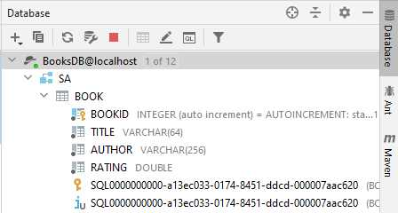
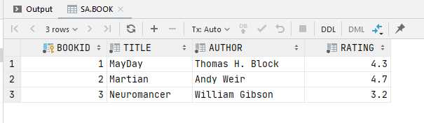

# 2 Vytvoření a připojení databáze do projektu

## Předpoklady

Předpokládá se nainstalovaná Idea, připojená k serveru Jetty, vytvořený projekt z předchozí kapitoly. Dále se předpokládá nainstalovaný a **spuštěný** databázový server Apache Derby na lokálním počítači \(localhost:1527, v opačném případě je třeba adekvátně změnit připojovací kód k databázi\). 

Předpokládá se znalost připojení databáze do prostředí Idea a znalost práce s touto databází přes konzoli Idea.

## 1 Vytvoření databáze pro projekt

Prvním krokem bude vytvoření databáze. Do Idea připojíme a vytvoříme databází "BooksDB" \(viz postup v tutorialech v předpokladech\), ve stručnosti:

1. Otevřeme podokno Idey "Database".
2. V okně přidáme nové připojení pro server "Apache Derby"
3. V otevřeném okně změníme typ připojení z "Embedded driver" na "Remote driver".
4. Připojíme se na server "localhost", port 1527, uživatelské jméno "sa", heslo libovolné vlastní \(důležité si jej zapamatovat!\), název databáze "BooksDB".
5. Otestujeme připojení a okno uzavřeme. Otevře se konzolové okno pro příkazy SQL.

Vytvoříme jednoduchou tabulku v databázi. Budeme využívat autoinkrementální primární klíč - tj. databáze si sama bude do primárního klíče přirazovat hodnoty pro nově vytvořené záznamy. Vložíme následující kód a spustíme jej:

```sql
create table Book(
        BookId int primary key generated always as identity,
        Title varchar(64) not null,
        Author varchar(256) not null,
        Rating float not null
);
```

Po vytvoření by se nám v prostředí Idea měla v databázovém okně v daném připojení ukázat vytvořená databázová tabulka:



Pomocí SQL do tabulky vložíme nějaká data a necháme si je vypsat/zobrazit:

```sql
insert into Book(Title, Author, Rating)
    values ('MayDay', 'Thomas H. Block', 4.3);
insert into Book(Title, Author, Rating)
    values ('Martian', 'Andy Weir', 4.7);
insert into Book(Title, Author, Rating)
    values ('Neuromancer', 'William Gibson', 3.2);

select * from Book
```


Všimněme si, že v SQL explicitně řikáme, do kterých sloupců chceme data vložit. Je to proto, že nemůžeme \(jednoduše\) vkládat data do sloupce `BookId`, který je nastavován automaticky. Nemůžeme proto použít jednodušší zápis `insert into Book values (...)`.




## 2 Připojení DB do webového projektu

