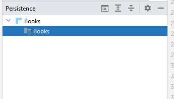
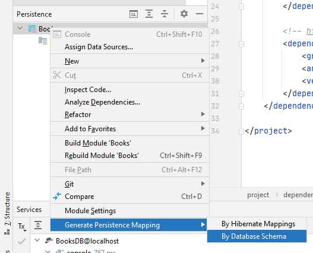
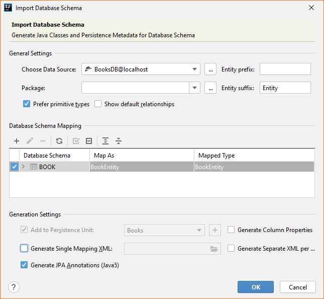

# 2 Vytvoření a připojení databáze do projektu

## Předpoklady

Předpokládá se nainstalovaná Idea, připojená k serveru Jetty, vytvořený projekt z předchozí kapitoly. Dále se předpokládá nainstalovaný a **spuštěný** databázový server Apache Derby na lokálním počítači \(localhost:1527, v opačném případě je třeba adekvátně změnit připojovací kód k databázi\). 

Předpokládá se znalost připojení databáze do prostředí Idea a znalost práce s touto databází přes konzoli Idea.

## 1 Vytvoření databáze pro projekt

Prvním krokem bude vytvoření databáze. Do Idea připojíme a vytvoříme databází "BooksDB" \(viz postup v tutorialech v předpokladech\), ve stručnosti:

1. Otevřeme podokno Idey "Database".
2. V okně přidáme nové připojení pro server "Apache Derby"
3. V otevřeném okně změníme typ připojení z "Embedded driver" na "Remote driver".
4. Připojíme se na server "localhost", port 1527, uživatelské jméno "sa", heslo libovolné vlastní \(důležité si jej zapamatovat!\), název databáze "BooksDB".
5. Otestujeme připojení a okno uzavřeme. Otevře se konzolové okno pro příkazy SQL.

Vytvoříme jednoduchou tabulku v databázi. Budeme využívat autoinkrementální primární klíč - tj. databáze si sama bude do primárního klíče přirazovat hodnoty pro nově vytvořené záznamy. Vložíme následující kód a spustíme jej:

```sql
create table Book(
        BookId int primary key generated always as identity,
        Title varchar(64) not null,
        Author varchar(256) not null,
        Rating float not null
);
```

Po vytvoření by se nám v prostředí Idea měla v databázovém okně v daném připojení ukázat vytvořená databázová tabulka:


Pomocí SQL do tabulky vložíme nějaká data a necháme si je vypsat/zobrazit:

```sql
insert into Book(Title, Author, Rating)
    values ('MayDay', 'Thomas H. Block', 4.3);
insert into Book(Title, Author, Rating)
    values ('Martian', 'Andy Weir', 4.7);
insert into Book(Title, Author, Rating)
    values ('Neuromancer', 'William Gibson', 3.2);

select * from Book
```


Všimněme si, že v SQL explicitně řikáme, do kterých sloupců chceme data vložit. Je to proto, že nemůžeme \(jednoduše\) vkládat data do sloupce `BookId`, který je nastavován automaticky. Nemůžeme proto použít jednodušší zápis `insert into Book values (...)`.



## 2 Připojení DB do webového projektu

Pro připojení do databáze budeme ve webovém projektu využívat knihovn EclipseLink \([https://www.eclipse.org/eclipselink/\#jpa](https://www.eclipse.org/eclipselink/#jpa)\). Pro připojení JPA do projektu využijeme Maven. 

### 2.1 Připojení ovladače databáze

Nejdříve připojíme ovladač databáze - ten je nutný, aby se aplikace uměla s databází domluvit:

1. Otevřeme web Maven Repository \([https://mvnrepository.com/](https://mvnrepository.com/)\) a necháme vyhledat "Apache Derby":
2. Vybereme položku "Apache Derby Client JDBC Driver" \([https://mvnrepository.com/artifact/org.apache.derby/derbyclient](https://mvnrepository.com/artifact/org.apache.derby/derbyclient)\) a požadovanou verzi podle databáze.
3. Zkopírujeme a přidáme do  `pom.xml` do bloku `<dependencies>` požadovanou knihovnu:

```markup
<!-- https://mvnrepository.com/artifact/org.apache.derby/derbyclient -->
<dependency>
    <groupId>org.apache.derby</groupId>
    <artifactId>derbyclient</artifactId>
    <version>10.15.2.0</version>
</dependency>
```

Obnovíme Maven, který stáhne požadované ovladače do projektu.


Jednotlivé závislosti - bloky `dependency` - vkládáme za sebou, nepřepisujeme je. Všechny bloky vkládáme dovnitř do bloku `dependencies`.



Po vložení nové závislosti by měl kód závislosti zčervenat - to znamená, že projekt sám ještě danou knihovnu nezná. Až obnovením Mavenu tento stáhne požadované knihovny do projektu a červená barva zmizí.


### 2.2 Připojení knihovny JPA - EclipseLink

Následně připojíme ovladač persistence - ten nabízí jednoduché metody pro načítání a ukládání objektů do databáze bez využití SQL:

1. Otevřeme web Maven Repository \([https://mvnrepository.com/](https://mvnrepository.com/)\) a necháme vyhledat "EclipseLink JPA".
2. Vybereme položku "EclipseLink JPA" \([https://mvnrepository.com/artifact/org.eclipse.persistence/org.eclipse.persistence.jpa](https://mvnrepository.com/artifact/org.eclipse.persistence/org.eclipse.persistence.jpa)\) a požadovanou verzi \(v našem případě 2.7.0\).
3. Zkopírujeme a přidáme do `pom.xml` do bloku `<dependencies>` požadovanou knihovnu:

```markup
<!-- https://mvnrepository.com/artifact/org.eclipse.persistence/org.eclipse.persistence.jpa -->
<dependency>
    <groupId>org.eclipse.persistence</groupId>
    <artifactId>org.eclipse.persistence.jpa</artifactId>
    <version>2.7.7</version>
</dependency>

```

Obnovíme Maven, který stáhne požadované ovladače do projektu.

Připojením knihovny "EclipseLink JPA" se zároveň v projektu aktivuje podpora tzv. Persistence.


Pokud by se tak nestalo, nebo bychom chtěli podporu perzistence aktivovat v projektu ručně, využijeme opět kontextové menu nad projektem "Books =&gt; Add Framework Support" a vybereme "JPA Persistence".


### 2.3 Nastavení persistence ve webovém projektu

Prvním krokem je aktivace modulu persistence ve webovém projektu, která však již proběhla na konci předchozího bodu. Že je modul aktivován se pozná podle menu "Persistence" v levém svislém sloupci prostředí Idea. Klikem na tuto záložku se otevře podokno Persistence, kde je uvedeno \(zatím prázdné\) nastavení persistence v projektu.




Do okna persistence se lze také dostat přes menu "View =&gt; Tool Windows =&gt; Persistence".


Dalším krokem bude vytvoření tzv "entit" - tříd, které reprezentují záznamy databázových tabulek. V našem případě potřebujeme entitu pro tabulku "Book". Entity si můžeme napsat sami ručně, nebo si je nechat vygenerovat. Pro generování zvolíme v okně Persistence nad libovolnou položkou kontextové menu a vybereme "Generate Persistence Mapping =&gt; By Database Schema".



V otevřeném dialogovém okně nastavujeme, jak a dle čeho se mají entity generovat. Nastavíme:

* Choose Data Source - vybereme datový zdroj pro připojení do databáze. Tento datový zdroj musí být zavedený v prostředí idea \(v Idea vpravo v záložce "Database"\).
* Package - název balíčku, do kterého se budou entity/třídy generovat. Například `cz.osu.books.db.entities`.
* Entity prefix/suffix udává před/příponu, která se bude přidávat před/za název třídy odvozené z názvu tabulky. Naše tabulka `Books`bude tedy reprezentována třídou `BooksEntity`.
* V "Database Schema Mapping" zaškrteneme požadované tabulky - po nás tedy tabulku "Books".
* Dole necháme ještě zaškrtnutou položku "Generate JPA Annotations" - v dřívějších verzích Javy se potřebné anotace \(tj. informace co odkud z DB se načítá ze které tabulky/sloupce\) ukládalo do externího XML souboru. Aktuálně je vhodnější mít tyto anotace přímo v kódu třídy.



Následně dialog potvrdíme. Po potvrzení, zda chceme opravdu provést generování se nás Idea ještě může zeptat, zda chceme třídy uložit do sekce "src/main" - zdrojové kódy, nebo "src/test" pro testování. Vybíráme `src/main/...`. Po potvrzení se:

* v okně Persistence objeví informace o entitě BookEntity,
* ve složce `src/main/java/cz.osu.books.db.entities`objeví soubor s třídou BookEntity.

