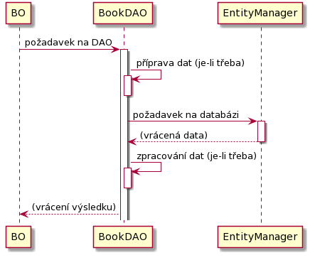

# 3 Implementace jednoduché databázové vrstvy

Nejdříve vysvětlíme základní princip fungování databázové vrstvy \(viz obrázek níže\):

1. Někdo \(vyšší vrstva\) pošle požadavek, že potřebuje realizovat nějakou operaci s databází \(načtení/uložení dat\). Tyto požadavky zasílá výhradně a pouze DAO objektu, u nás "BookDAO".
2. BookDAO požadavek zpracuje, předpřipraví si data \(je-li to třeba\) a následně požadavek předá níže objektu "EntityManager". EntityManager je implementován v JPA a my jen budeme využívat jeho hotové funkcionality.
3. EntityManager nám vrátí data. BookDAO je opět zpracuje, je-li třeba, a výsledek vrací volajícímu objektu.




V kontextu této vrstvy budeme pracovat se dvěma typy třídy - DAO \(data access object\) bude třídou, která poskytuje operace s danou entitou. DAO je typicky postfixem třídy, kdy prefixem je název tabulky \(například BookDAO, UserDAO, AuthorDAO\). Dnes má tato třída také postfíx Persistence \(BookPersistence, UserPersistence atd\). Každá entita má vlastn DAO objekt.

Obdobně, třída, která nám bude reprezentovat záznamy z tabulky, má název složený z názvu tabulky a příponou Entity. Takovým třídám říkáme _entity_.

Tato pravidla pro pojmenování tříd jsou libovolná, je však dobrá si nějaká stanovit, protože to výrazně zvyšuje čitelnost kódu.



Vytváření jednoho DAO objektu pro všechny entity je možné, ale není to vhodné, protože se s množícím se počtem metod rychle snižuje čitelnost jejího kódu.

Naopak běžnější je vytvoření abstraktní DAO třídy, která zastřešuje společné operace pro DAO třídy - potomky. S využitím generik se jedná o silný nástroj.


Databázová vrstva je pro nás tedy z implementačního hlediska představována objektem BookDAO - hlavní třídou, která se bude starat o všechny databázové operace s knihami, a třídou BookEntity, která reprezentuje jeden řádek v tabulce. Protože tato třída nic aktivně nevykonává \(je pouze nosičem dat\), není v procesu volání znázorněna. Pokud má třída BookDAO realizovat základní databázové operace, nejdříve rychle nadefinujeme operace, které po ní budeme vyžadovat - vkládání, mazání a získání všech záznamů jako listu:


```java
public class BookDAO {

    public void insert(BookEntity book) { }

    public void delete(int bookId) { }

    public List<BookEntity> getAll(int maxCount) { }
}
```


### 3.1 Vytvoření podpůrné třídy - Výjimky - pro zpracování chyb

Před samotnou implementací ještě vytvoříme pomocnou třídu - výjimku, kterou bude naše DAO třída vyhazovat v případě jakékoliv chyby. Abychom nemuseli pracovat s principem kontrolovaných výjimek v Javě, využijeme potomka `RuntimeException`. Třídu pojmenujeme `DbException`a připojíme jí také konstruktor pro její snažší použití. Její úplný kód bude:


```java
package cz.osu.books.db;

public class DbException extends RuntimeException {
    public DbException(String message, Throwable cause) {
        super("DAO operation error. " + message, cause);
    }
}
```


### 3.2 Vytvoření interní logiky pro práci ve třídě BookDAO

instance třídy BookDAO pro svou práci potřebuje instanci třídy EntityManager, přes kterého bude provádět operace s databází. Aby každá operace insert/delete/... nemusela tuto problematiku řešit samostatně, přípravu a tvorbu entitního manažera `em` vytvoříme pomocí několika metod, které posléze budeme volat v každé z operací:

```java
private static final String PERSISTENCE_UNIT_NAME = "BooksPU";
private static EntityManagerFactory emf = null;
private EntityManager em = null;

private EntityManager getEm(){
    if (emf == null) initEmf();
    if (em == null) initEm();
    return em;
}

private void initEmf(){
    try {
        emf = javax.persistence.Persistence.createEntityManagerFactory(PERSISTENCE_UNIT_NAME);
    } catch (Exception e) {
        throw new DbException(
                "Failed to initialize EntityManagerFactory.", e);
    }
}

private void initEm(){
    try {
        this.em = emf.createEntityManager();
    } catch (Exception e) {
        throw new DbException(
                "Failed to initialize EntityManager.", e);
    }
}
```

V kódu máme několik částí:

* Konstanta`PERSISTENCE_UNIT_NAME` obsahuje název persistentní jednotky, kterou jsme vytvořili v kapitole 2. Pokud je název persistentní jednotky v souboru `persistence.xml`jiný, musíme zde hodnotu konstanty odpovídajícím způsobem opravit.
* Proměnná `emf` se používá při tvorbě entitního manažera. Protože se jedná o továrnu pro všechny manažery, může být statická a sdílená všemi instancemi třídy BookDBO.
* Proměnná `em` reprezentuje entitního manažera konkrétní instance. Tato třída bude později provádět databázové operace.
* Funkce `getEm()` je hlavní funkcí, kterou budou operace insert/delete/... volat v případě, že potřebují pracovat s entitním manažerem. Tato funkce zajistí, že jsou objekty `emf`a `em` naplněny hodnotami. Všechny funkce kromě inicializačních funkcí **musí** pro práci s entitním manažerem využít tuto funkci, aby bylo zajištěno, že je proměnná `em` korektně naplněna. Funkce sama o sobě zkontroluje, zda jsou objekty `emf`a `em` naplněny, případně zavolá jejich inicializaci.
* Funkce `initEmf()` a `initEm()` vytvářejí nové instance požadovaných objektů. V případě chyby vyhazují výjimku typu `DbException` vytvořenou dříve.

