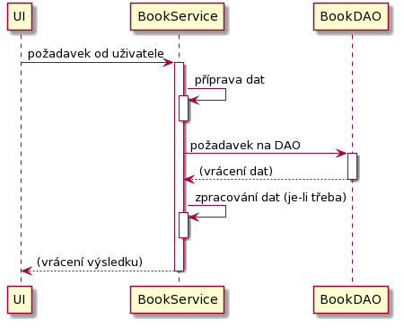

# 4 Implementace jednoduché aplikační vrstvy

Funkcí aplikační vrstvy je převzít požadavek od nadřazené \(typicky prezentační\) vrstvy a zpracovat jej. Aplikační, modelová vrstva, realizuje byznys logiku aplikace - tj. všechny funkcionality aplikace, které se odehrávají uvnitř aplikace.

Jednoduchý diagram ukazující spolupráci s UI - prezentační vrstvou - a databázovou vrstvou následuje a na první pohled je vidět, že základní princip je identický s principem uvedeným v předchozí kapitole:



Co je důležité si povšimnout, že diagram dále nepokračuje na nižší úroveň než "BookDAO" - a to kvůli princpiu zapouzdření a abstrakce. Nám, na úrovni aplikační vrstvy, je jedno, jakým způsobem si třída BookDAO řeší problematiku ukládání/načítání dat. Využíváme ji pouze jako zprostředkovatele dané funkcionality.

Aplikační vrstvu bude v našem případě reprezentovat třída BookService \(vytvořte ji do balíčku `cz.osu.books.app`\), která bude opět nabízet základní metody:

```java
public class BookService {
    public BookEntity create(String title, String author, double rating){}

    public void delete(int bookId){}

    public List<BookEntity> getAll(){}
}
```

Všimněme si rozdílu oproti metodám BookDAO. Metody v BookService nabízejí stejné operace, ale na jiné úrovni - zejména je to patrné u funkce `create(...)`, kde se už nepracuje s objektem BookEntity, ale přímo se samotnými hodnotami.

Protože naše třída BookService bude obsahovat pouze základní operace, její kód bude triviální \(kontrolu vstupů doplníme v úplném výpisu kódu\):



```java
private final BookDAO dao;

public BookService() {
    this.dao = new BookDAO();
}
```



```java
public BookEntity create(String title, String author, double rating) {
    BookEntity book = new BookEntity();
    book.setTitle(title);
    book.setAuthor(author);
    book.setRating(rating);

    this.dao.insert(book);

    return book;
}
```



```java
public void delete(int bookId) {
    this.dao.delete(bookId);
}
```



```java
public List<BookEntity> getAll() {
    List<BookEntity> ret = this.dao.getAll();
    return ret;
}
```



V rámci **inicializace** se vytvoří proměnná držící odkaz na objekt BookDAO, který bude využit pro práci s databází. Proměnná je naplněna v konstruktoru.

Funkce **create** převede parametry do nové instance objektu BookEntity \(všimněte si, že se nenaplňuje b`bookId`, protože toto bude přiřazeno v databázi automaticky\) a objekt se následně zašle k uložení. Poté se výsledek vrací z funkce zpět.

Funkce **delete** jen přebere hodnotu parametru a předává ji ke smazání do databáze.

Funkce **getAll** podobně jen načte hodnoty z databáze a vrátí je z funkce.

Rychlou kontrolu funkce opět provedeme přes `index.jsp` drobnou úpravou kódu,  zobrazujeme i úplný obsah BookService doplněný o kontroly vstupů:




```markup
<%@ page import="cz.osu.books.db.entities.BookEntity" %>
<%@ page import="java.util.List" %>
<%@ page import="cz.osu.books.app.BookService" %>
<%@ page contentType="text/html;charset=UTF-8" language="java" %>
<%@ taglib prefix="c" uri="http://java.sun.com/jsp/jstl/core" %>
<html>
<head>
    <title>$Title$</title>
</head>
<body>
    <%
        BookService bookService = new BookService();
        List<BookEntity> books = bookService.getAll();
    %>
    Knih: <%= books.size() %>.
</body>
</html>

```





```java
package cz.osu.books.app;

import cz.osu.books.db.BookDAO;
import cz.osu.books.db.entities.BookEntity;

import java.util.List;

public class BookService {

    private final BookDAO dao;

    public BookService() {
        this.dao = new BookDAO();
    }

    public BookEntity create(String title, String author, double rating) {
        if (title == null || title.trim().length() == 0)
            throw new IllegalArgumentException("Title cannot be null or empty.");
        if (author == null || author.trim().length() == 0)
            throw new IllegalArgumentException("Author cannot be null.");
        if (rating < 0 || rating > 10)
            throw new IllegalArgumentException("Rating must be between 0 and 10.");
        BookEntity book = new BookEntity();
        book.setTitle(title);
        book.setAuthor(author);
        book.setRating(rating);

        this.dao.insert(book);

        return book;
    }

    public void delete(int bookId) {
        this.dao.delete(bookId);
    }

    public List<BookEntity> getAll() {
        List<BookEntity> ret = this.dao.getAll();
        return ret;
    }
}
```




Aplikace by opět měla jít spustit a zobrazit počet knih. Nicméně, implementaci prezentační vrstvy provedem trošku "odbornějším" způsobem v další části.

