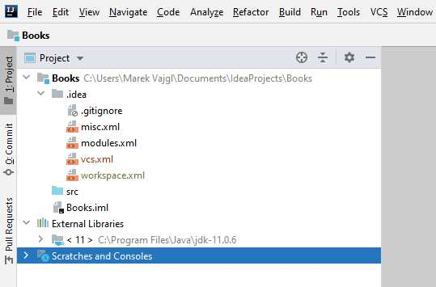
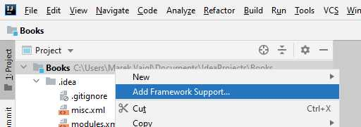
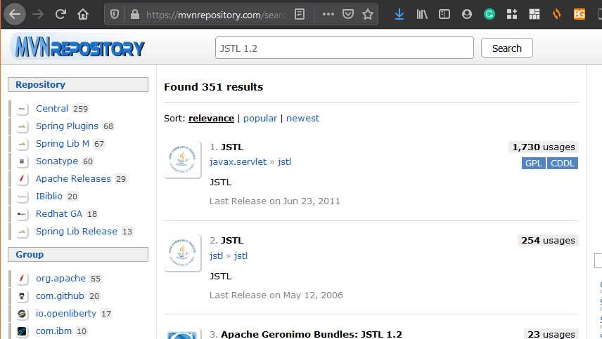
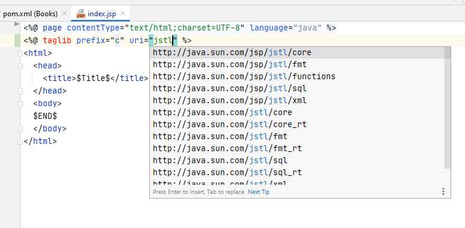

# 1 Vytvoření projektu v Idea

## Předpoklady

Předpokládáme nainstalované prostředí Idea, nainstalovanou Javu - JDK verzi 11 a vyšší. Dále se předpokládá nainstalovaný a do Idea připojený webový server Jetty.

## 1 Vytvoření nového projektu

Spustíme prostředí Idea a vytvoříme nový projekt:

1. Vybereme File =&gt; New =&gt; Project.
2. Zvolíme projekt čistá "Java", nepřidáváme další knihovny.
3. Proklikáme beze změn průvodce až na stranu, kde se zadává název projektu.
4. Zadáme název projektu "Books" a potvrdíme vytvoření.

Nyní byl vytvořen prázdný projekt. V projektu nejsou žádné obsahové soubory \(jen soubory Idea popisující projekt\) a projekt nelze spustit.



## 2 Převedení projektu na webový projekt

Dalším krokem je převedení projektu na webový projekt:

1. Nad projektem **Books** otevřeme kontextové menu a vybereme položku "Add Framework Support" \(viz obrázek níže\).
2. Vybereme položku "Java EE =&gt; Web Application" a volbu potvrdíme ok. V projektu se nám vytvoří složky "src" a "web", ve druhé jmenované se objeví výchozí soubor `index.jsp`.
3. Přidáme konfiguraci pro spuštění:
   1. Vybereme menu "Run =&gt; Edit Configurations".
   2. V otevřeném dialogu vybereme "+ =&gt; Jetty Server =&gt; Local" \(první volbou je rozbalení tlačítka se symbolem plus +\).
   3. V dolní části okna opravíme chybu "**Warning:** No artifacts marked for deployment" stisknutím tlačítka "Fix". Stisk nás přenese na záložku "Deployment", vrátíme se zpátky na záložku "Server".
   4. \(Volitelné\) Je vhodné zvolit "On 'Update' Action" na "Update classes and resources", protože to bude volba, kterou budeme nejčastěji používat.
   5. Potvrdíme dialog ok.
4. Spustíme webovou aplikaci. Mělo by se otevřít okno prohlížeče s obsahem prázdné stránky a nápisem $END$.



## 3 Přidání podpory _Maven_

Nad projektem opět otevřeme kontextové menu a vybereme "Add Framework Support". Nalezneme a zvolíme položku "Maven" a potvrdíme. Do projektu přibude soubor `pom.xml`.


_Maven_ je nástroj, který nám umožní lepší správu a práci s projektem. V našem případě ulehčí přidávání závislostí a knihoven, které bychom jinak museli řešit sami a ručně.


_Maven_ využívá konfigurační soubor `pom.xml`k upřesnění konfigurace a obsahu projektu. Do tohoto souboru budeme dopisovat informace. Aby _Maven_ věděl, kdy je má použít, synchronizace obsahu s projektem se provádí ručně na vyžádání. V Idea napravo nalezneme nyní záložku "Maven", po jejím rozbalení je hned první ikonka se symbolem obnovení \(dvě šipky v kruhu - "Reload all Maven projects"\). Stiskem ikonky se provede synchronizace a úprava projektu v Idea tak, aby odpovídal konfiguraci v `pom.xml`. Vždy, když provedeme změnu v tomto souboru, musíme provést toto obnovení. Obnovení někdy může chvilku trvat, protože Maven přitom může stahovat požadované závislosti z internetu.


Pro verzi Javy 9 a vyšší je třeba ještě do souboru `pom.xml` doplnit přesnou verzi, aby prostředí Maven vědělo, s jakou verzí Javy má pracovat; znak `X` reprezentuje požadovanou verzi Javy, tedy například `1.11`pro Javu 11:

```markup
    <properties>
        <maven.compiler.source>1.X</maven.compiler.source>
        <maven.compiler.target>1.X</maven.compiler.target>
    </properties>
```

Celý soubor pro Javu 11 tedy bude vypadat následovně:


```markup
<?xml version="1.0" encoding="UTF-8"?>
<project xmlns="http://maven.apache.org/POM/4.0.0"
         xmlns:xsi="http://www.w3.org/2001/XMLSchema-instance"
         xsi:schemaLocation="http://maven.apache.org/POM/4.0.0 http://maven.apache.org/xsd/maven-4.0.0.xsd">
    <modelVersion>4.0.0</modelVersion>

    <groupId>groupId</groupId>
    <artifactId>Books</artifactId>
    <version>1.0-SNAPSHOT</version>

    <properties>
        <maven.compiler.source>1.11</maven.compiler.source>
        <maven.compiler.target>1.11</maven.compiler.target>
    </properties>        
</project>
```


Po uložení zkusíme projekt spustit, abychom se ujistili, že vše probíhá v pořádku.

## 4 Přidání podpory JSTL

### 4.1 Instalace JSTL

Dalším krokem je přidání podpory knihovny JSTL, abychom v JSP mohli využívat příkazy `<c:for...` a další. Import již provedeme přes Maven.

Nejdříve musíme najít potřebnu knihovnu. Otevřeme Maven Repository web [https://mvnrepository.com/](https://mvnrepository.com/). Do vyhledávacího pole zadáme JSTL 1.2 \(verze knihovny\) a zobrazíme si výsledek.



Vybereme knihovnu JSTL \(javax.servlet &gt;&gt; jstl\) a otevřeme její nabídku.  Zobrazí se nám dostupné verze.


Vybereme požadovanou verzi. Po kliku na verzi se objeví "příkaz", který zajistí importování knihovny přes Maven. 


Příkaz zkopírujeme a vložíme do souboru `pom.xml` našeho projektu do tagu `<dependencies>`. Tento tag nejspíše neexistuje a bude jej třeba vytvořit uvnitř tagu `<project>`. Odpovídající část souboru bude tedy vypadat následovně:


```markup
<?xml version="1.0" encoding="UTF-8"?>
<project xmlns="http://maven.apache.org/POM/4.0.0"
         xmlns:xsi="http://www.w3.org/2001/XMLSchema-instance"
         xsi:schemaLocation="http://maven.apache.org/POM/4.0.0 http://maven.apache.org/xsd/maven-4.0.0.xsd">
    <modelVersion>4.0.0</modelVersion>

    <groupId>groupId</groupId>
    <artifactId>Books</artifactId>
    <version>1.0-SNAPSHOT</version>
    
    <properties>
        <maven.compiler.source>1.11</maven.compiler.source>
        <maven.compiler.target>1.11</maven.compiler.target>
    </properties>    

    <dependencies>
        <!-- https://mvnrepository.com/artifact/javax.servlet/jstl -->
        <dependency>
            <groupId>javax.servlet</groupId>
            <artifactId>jstl</artifactId>
            <version>1.2</version>
        </dependency>
    </dependencies>
    
</project>
```


Vložený text bude nejspíše svítit červeně, protože projekt soubory této knihovny nezná. Nyní je třeba Maven synchronizovat/obnovit, aby se změny v souboru promítly do projektu. Otevřeme záložku Maven \(viz výše\) a stiskneme tlačítko pro obnovení \(dvě šipky v cyklu proti sobě, viz výše\). Maven stáhne knihovnu z webu a přidá ji do projektu.

### 4.2 Ověření fungování JSTL

Dalším krokem bude ověření, že instalace proběhla v pořádku. Fungování ověříme tím, že jednoduše nějakou funkcionalitu knihovny JSTL vyzkoušíme.

Prvním krokem bude import knihovny JSTL do JSP stránky. Otevřeme soubor `web\index.jsp` a doplníme do něj přidání knihovny pomocí příkazu: `<%@ taglib prefix="c" uri=" " %>`. Pri průběžném psaní nám prostředí Idea bude napovídat a prvním ověřením fungování JSTL je, že v atributu "uri" se automaticky objeví nabídka dostupných prostorů z JSTL. Vybíráme/napíšeme položku `http://java.sun.com/jsp/jstl/core`.




Knihovna, kterou z JSTL využíváme, se jmenuje "core". Pozor, že v URL nabídce je z historických důvodů uvedena 2x, srovnej:

* `http://java.sun.com/jsp/jstl/core` - ta správná verze pro nás,
* `http://java.sun.com/jstl/core` - historická verze.

Je důležité zkontrolovat, že jste vybrali správnou verzi, jinak další kód nebude fungovat.


Dalším krokem bude přidání kódu do JSP stránky, který bude využívat JSTL. Do tagu `<body>`doplníme:

```markup
<body>  
  <c:set var="datum" value="1" />
  <c:if test="${datum == 1}">
    Hodnota je jedna.
  </c:if>
<body>
```

Stránku zkusíme spustit. Měl by se zobrazit výsledek zobrazující nápis: "Hodnota je jedna." Následuje úplný výpis kódu souboru index.jsp.


```markup
<%@ page contentType="text/html;charset=UTF-8" language="java" %>
<%@ taglib prefix="c" uri="http://java.sun.com/jsp/jstl/core" %>
<html>
  <head>
    <title>$Title$</title>
  </head>
  <body>
  <c:set var="datum" value="1" />
  <c:if test="${datum == 1}">
    Hodnota je jedna.
  </c:if>
  </body>
</html>

```


### 4.3 Přidání podpory Servletů

Přidání knihovny pro podporu Servletů, které budou zpracovávat uživatelské požadavky v naší aplikaci, už bude jednoduché. 

V Maven repozitáři vyhledáme položku "Servlet", zvolíme "Java Servlet API" \([https://mvnrepository.com/artifact/javax.servlet/javax.servlet-api](https://mvnrepository.com/artifact/javax.servlet/javax.servlet-api)\), nalezneme odpovídající verzi a její kód opět vložíme do `pom.xml`. Obnovíme Maven.

```markup
<!-- https://mvnrepository.com/artifact/javax.servlet/javax.servlet-api -->
<dependency>
    <groupId>javax.servlet</groupId>
    <artifactId>javax.servlet-api</artifactId>
    <version>4.0.1</version>
    <scope>provided</scope>
</dependency>
```

