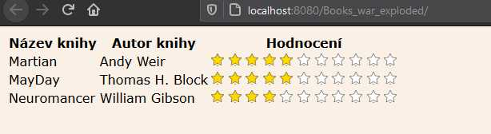

# 5 Implementace jednoduché prezentační vrstvy

V rámci prezentační vrstvy se opřeme o technologie JSP pro tvorbu webových stránek \(doplněnou o JSTL pro "chytřejší" způsob psaní stránky\), které budou zobrazovat obsah, a technologii Servletů pro webové stránky, které budou vyvolány na základě vstupů od uživatele.

## 1 Zobrazení knih v index.jsp

Nejdříve realizujeme zobrazení knih v tabulce s využitím stránky `index.jsp`.

### 1.1 Připojení služby BookService

Prvním krokem bude připojení objektu BookService z aplikační vrstvy do naší stránky. Využijeme možnost využití tzv. Java Enterprise Beans, která nám pomocí speciálního JSP tagu do stránky zavede instanci této služby \(element umístíme nahoru před začátek elementu `<html>`:

```markup
<jsp:useBean id="bookService" 
    class="cz.osu.books.app.BookService" 
    scope="request" />
```

Využíváme tag `jsp:useBean`s následujícími atributy:

* **id -** udává název proměnné, pomocí kterého se budeme k danému objektu \(bean\) odkazovat. V  našem případě proměnnou nazveme `bookService`.
* **class -**  udává název třídy \(včetně názvů nadřazených balíčků\), ze které bude objekt třídy vytvořen. Třída musí mít veřejný konstruktor bez parametrů. V našem případě bude hodnotou naše třída na aplikační vrstvě, tedy `cz.osu.books.app.BookService`.
* **scope -** udává rozsah platnosti instance, tj. "od kdy do kdy" bude instance existovat. Možnosti jsou: i\) pro celou aplikaci - `application`; ii\) pro dané sezení/uživatele - `session`; iii\) pro daný požadavek včetně přesměrování na jiné stránky - `request`; iv\) pouze pro danou JSP stránku - `page`. V našem případě chceme, aby služba obsloužila pouze náš jeden databázový požadavek a potom se ukončila \(aby se zbytečně nedrželo databázové připojení\), proto zvolíme `request`nebo `page`. 

### 1.2 Základní výpis knih

Druhým krokem bude zavedení nebo kontrola připojení knihovny JSTL - nad elementem `<head>`musí být také:

```markup
<%@ taglib prefix="c" uri="http://java.sun.com/jsp/jstl/core" %>
```

Nyní přejdeme do těla - dovnitř elementu `<body>...</body>`. Smažeme veškerý obsah uvnitř tohoto elementu, který jsme dříve používali na testování a budeme psát kód, který zobrazí všechny knihy v tabulce. Nejdřív vytvoříme prázdnou HTML tabulku se záhlavím:

```markup
<table>
    <tr>
        <th> Název knihy</th>
        <th> Autor knihy</th>
    </tr>
    <!-- zde přijde obsah -->
</table>
```

Následně vytvoříme cyklus `for`, který bude procházet postupně všechny knihy. Cyklus vytvoříme pomocí JSTL knihovny a jejího tagu `<c:for>...</c:for>`, vložíme jej na místo, kam má přijít obsah zmíněný v předchozím výpisu:

```markup
<c:forEach var="book" items="${bookService.all}">
</c:forEach>
```

Tento příkaz říká, že se mají provádět iterace přes list, který se získá z `bookService.all`. Při každé iteraci se na konkrétní knížku budeme odkazovat jako na proměnnou `book`. Tento zápis je zajímavý z několika pohledů:

* Zápis s využitím `${...}` je tzv. _Expression Language_ \(EL\) a je to zkrácený a jednouchý způsob, jak v JSP zapisovat určité výrazy. V našem případě výraz říká, že se má získat hodnota proměnné `bookService` a nad ní zavolat `all` - viz dále.
* V rámci tečkové notace můžeme v EL využívat dva způsoby:
  * Uvedený, `${bookService.all}` pracuje s předpokládaným _getterem_ nad objektem. To znamená, že pro `all` se předpokládá, že existuje funkce `getAll()`, která je veřejná a nemá žádné parametry. 
  * Přímé volání metod, tzn. například `${bookService.getAll()}`. Ten předpokládá, že existuje metoda `getAll()`, která vrátí požadovaný výsledek.
* Dovnitř elementu `c:forEach`můžeme zapisovat další HTML/JSP obsah. Tento obsah se bude cyklicky volat pro všechny knihy nalezené v poskytnutém listu knížek.

Následně tedy doplníme vnitřek cyklu tak, aby generoval jednotlivé řádky a jejich sloupce s požadovaným obsahem:

```markup
<c:forEach var="book" items="${bookService.all}">
    <tr>
        <td>${book.title}</td>
        <td>${book.author}</td>
    </tr>
</c:forEach>
```

V zápisu se opět využívá EL. Zajímavostí je zde je, že pokud použijeme `bookService.all`jako zdroj dat, umí Idea při zápisu `${book....}` napovídat možné členy. Na tyto opět přistupujeme pomocí předpokládaných getterů, tedy `${book.title}`, namísto funkčního zápisu `${book.getTitle()}`; zde je přínos v přehledu kódu nesporný.

Nyní ukážeme úplný kód `index.jsp`a pro vyzkoušení jej lze spustit:


```markup
<%@ page contentType="text/html;charset=UTF-8" language="java" %>
<%@ taglib prefix="c" uri="http://java.sun.com/jsp/jstl/core" %>
<jsp:useBean id="bookService" class="cz.osu.books.app.BookService" 
    scope="request"/>
<html>
<head>
    <title>Přehled knih</title>
</head>
<body>
<table>
    <tr>
        <th> Název knihy</th>
        <th> Autor knihy</th>
    </tr>
    <c:forEach var="book" items="${bookService.all}">
        <tr>
            <td>${book.title}</td>
            <td>${book.author}</td>
        </tr>
    </c:forEach>
</table>
</body>
</html>
```


### 1.3 Zobrazení hodnocení knihy, CSS

Pro zobrazení ratingu/hodnocení knížky využijeme CSS, proto jej do projektu přidáme. Nejdříve do složky `web\resources` \(pokud neexistuje, vytvoříme\) přidáme přes kontextové menu "New =&gt; Stylesheet" nový soubor `books.css`. Do souboru dáme pro začátek nějaký jednoduchý obsah:


```css
body{
    font-family: "Verdana";
    background-color: linen;
}
```


Dále soubor připojíme do stránky `index.jsp`tím, že jej přidáme do hlavičky:

```markup
...
<head>
    <title>Přehled knih</title>
    <link type="text/css" rel="stylesheet" href="resources/books.css" >
</head>
...
```

Projekt spustíme a měli bychom vidět změnu fontu a barvy pozadí.

Rating budeme vykreslovat pomocí hvězdiček. Do složky `web\resources`umístěte dva obrázky svítící a nesvítící hvězdy `starOn.png` a `starOff.png`. Oba obrázky musí mít rozlišení 16x16 pixelů. Do `books.css` dopište styly pro elementy `div`, které budeme pro obrázky využívat:

```css
...

div.rating{
    width:16px;
    height:16px;
    display: inline-block;
}

div.ratingOn{
    background-image: url('starOn.png');
}

div.ratingOff{
    background-image: url('starOff.png');
}
```

Nyní upravíme samotný `index.jsp`. Do hlavičky tabulky přidáme další sloupec. Do obsahu tabulky také, ale tento kód bude složitější:

```markup
<c:forEach var="i" begin="0" end="10" step="1">
    <c:choose>
        <c:when test="${i <= book.rating}">
            <div class="rating ratingOn"></div>
        </c:when>
        <c:otherwise>
            <div class="rating ratingOff"></div>
        </c:otherwise>
    </c:choose>
</c:forEach>
```

Hlavní smyčka `c:forEach`provádí klasickou smyčku od 0 \(`begin`\) do 10 \(`end`\) v kroku po jedné \(`step`\). Iterovanou proměnnou je `i`\(`var`\). 

Uvnitř je alternativa příkazu "switch/case" - příkaz `c:choose`zahajuje výběr. V našem kódu máme dvě větve - `c:when`, která testuje podmínku `test`, zda hodnocení knihy je menší než hodnota `i`. Celý výraz je zapsán uvnitř EL: `${i <= book.rating}`. Druhá větev `c:otherwise` se provádí, pokud podmínka první větve není splněna. V obou větvích se pak už jen zobrazí `div` s odpovídajícími css-třídami. Smyčka tedy pro každou knihu udělá cyklus proměnné `i` od 0 do 10 - pokud je `i` menší než hodnocení knihy, zobrazí se ikona svítící hvězdy, jinak ikona hvězdy nesvítící.




```markup
<%@ page contentType="text/html;charset=UTF-8" language="java" %>
<%@ taglib prefix="c" uri="http://java.sun.com/jsp/jstl/core" %>
<jsp:useBean id="bookService" class="cz.osu.books.app.BookService" scope="request"/>
<html>
<head>
    <title>Přehled knih</title>
    <link type="text/css" rel="stylesheet" href="resources/books.css">
</head>
<body>
<table>
    <tr>
        <th>Název knihy</th>
        <th>Autor knihy</th>
        <th>Hodnocení</th>
    </tr>
    <c:forEach var="book" items="${bookService.all}">
        <tr>
            <td>${book.title}</td>
            <td>${book.author}</td>
            <td>
                <c:forEach var="i" begin="0" end="10" step="1">
                    <c:choose>
                        <c:when test="${i <= book.rating}">
                            <div class="rating ratingOn"></div>
                        </c:when>
                        <c:otherwise>
                            <div class="rating ratingOff"></div>
                        </c:otherwise>
                    </c:choose>
                </c:forEach>
            </td>
        </tr>
    </c:forEach>
</table>
</body>
</html>
```




```css
body{
    font-family: "Verdana";
    background-color: linen;
}

div.rating{
    width:16px;
    height:16px;
    display: inline-block;
}

div.ratingOn{
    background-image: url('starOn.png');
}

div.ratingOff{
    background-image: url('starOff.png');
}
```





### 1.4 Mazání knihy

Výmaz knihy budeme provádět požadavkem typu POST přes specifický Servlet.


V této fázi přepodkládáme, že v souboru `pom.xml`již je navedena podpora servletů `java-servlet-api`.


Nejdříve vytvoříme servlet. Do projektu do složky `src\main\java` vložíme nový servlet přes kontextové menu "New =&gt; Servlet". \(Pokud nabídka Servletu není dostupná, přidáme klasickou třídu, kterou si na servlet upravíme.\) Servlet/Třídu pojmenujeme a vložíme do balíčku `cz.osu.books.servlets.DeleteBook`. Kód třídy/servletu upravíme do základního tvaru:


```java
package cz.osu.books.servlets;

import javax.servlet.ServletException;
import javax.servlet.annotation.WebServlet;
import javax.servlet.http.HttpServlet;
import javax.servlet.http.HttpServletRequest;
import javax.servlet.http.HttpServletResponse;
import java.io.IOException;

@WebServlet(name="DeleteBook" ,urlPatterns = {"/deleteBook"})
public class DeleteBook extends HttpServlet {
}

```


Důležitá je použitá anotace `@WebServlet`a její parametr `urlPatterns`, který reprezentuje cestu/y, pomocí kterých se na servlet dá dostat. V našem případě cesta bude `http://.../deleteBook`.

Servlet zpracovává jednotlivé příchozí HTTP požadavky pomocí doXXX\(\) metod, kde XXX reprezentuje použitou HTTP metodu. My chceme využívat metodu POST, protože z `index.jsp` si pomocí této metody budeme posílat požadavky na vymazání položky. Proto ve třídě překryjeme metodu `doPost(...)`.

```java
@Override
protected void doPost(HttpServletRequest req, HttpServletResponse resp) 
    throws ServletException, IOException {
}
```

Funkce přebírá dva parametry, `request` a `response` , které reprezentují příchozí požadavek od klienta a odchozí odpověď pro klienta.

My v našem kódu od klienta zjistíme zaslané ID knížky k vymazání, vytvoříme si instanci `BookService`, pomocí které záznam vymažeme a následně řekneme klientovi, aby se vrátil zpátky na úvodní stranu `index.jsp`. Výsledný kód servletu:


```java
package cz.osu.books.servlets;

import cz.osu.books.app.BookService;
import javax.servlet.ServletException;
import javax.servlet.annotation.WebServlet;
import javax.servlet.http.HttpServlet;
import javax.servlet.http.HttpServletRequest;
import javax.servlet.http.HttpServletResponse;
import java.io.IOException;

@WebServlet(name = "DeleteBook", urlPatterns = {"/deleteBook"})
public class DeleteBook extends HttpServlet {

    @Override
    protected void doPost(HttpServletRequest req, HttpServletResponse resp)
            throws ServletException, IOException {

        String bookIdString = req.getParameter("bookId");
        int bookId = Integer.parseInt(bookIdString);

        BookService bookService = new BookService();
        bookService.delete(bookId);

        resp.sendRedirect("index.jsp");
    }
}
```


Povšimněte si názvu parametru `bookId`. Je důležitý, za malou chvilku se mu budeme věnovat.

Když je servlet hotový, na stránce `index.jsp`vytvoříme tlačítko, které tento servlet zavolá. Protože chceme volání servletu realizovat jako HTTP-POST požadavek, potřebujeme ve stránce vytvořit formuláře \(pro každou knihu jeden\), kde nastavíme požadovaní ID knihy ke smazání a tlačítko pro odeslání formuláře - vše jako další sloupec každého řádku tabulky:

```markup
<c:forEach var="book" items="${bookService.all}">
    <tr>
        ...
        <td>
            <form method="post" action="deleteBook">
                <input type="hidden" name="bookId" value="${book.bookid}"/>
                <button type="submit">(Smazat)</button>
            </form>
        </td>
    </tr>
</c:forEach>
```

V kódu tedy vidíme, že se uvnitř cyklu `c:forEach`pro každou knížku vytváří ve sloupci `td`formulář pro smazání. Formulář se při potvrzení posílá metodou post na url`deleteBook`, pod kterou máme namapován náš servlet \(viz anotace `@WebServlet`u deklarace servletu `DeleteBook`\). Formulář se tedy při potvrzení přesměruje a pošle na tento servlet. Uvnitř formuláře je jeden prvek, který je ale skrytý \(`hidden`\), aby jej uživatel neviděl a nemohl měnit, a tento prvek se jmenuje `bookId` \(viz kód servletu, ze kterého jsme získávali parametr `bookId`\) a má nastavenou hodnotu na id knihy pomocí EL \(`${book.bookid}`\). Dále je na formuláři tlačítko na odeslání formuláře \(button typu `submit`\) s nápisem "\(Smazat\)". Důležité body ještě jednou:

* Formulář se posílá na náš servlet DeleteBook. Cesta uvedená v HTML formuláři `action` a v servletu pod `urlPatterns` na sebe musí pasovat.
* Formulář se posílá metodou POST. Náš servlet tím, že obsahuje pouze metodu `onPost(...)`, je nastaven tak, aby zpracovával pouze požadavky typu POST.
* Parametr, který chceme předávat do servletu, musíme v HTML formuláři pojmenovat pomocí vlastnosti `name`. 

Nyní můžeme funkcionalitu vyzkoušet.


Pokud v databázi nemáme žádné knihy, nic nám nebrání si tam nějaké přidat. Nemáme sice zatím funkcionalitu na přidání knihy, ale můžeme využít přímo okna konzole nad datovým zdrojem, které nabíz prostředí Idea - viz postup vytváření databáze.


### 1.5 Přidání nové knihy

Při přidání nové knihy budeme postupovat stejně jako u mazání. Nejdříve vytvoříme servlet, který bude přidání nové knihy obsluhovat, a následně vytvoříme HTML kód, který nabídne uživateli vytvoření knihy a po potvrzení bude daný servlet využívat.

Nejprve tedy vytvoříme servlet. Stejným způsobem jako v předchozím případě vložíme do projektu nový servlet/třídu: servlet dáváme do balíčku `cz.osu.books.servlets`a nazveme ji `AddBook`. Do třídy vložíme anotaci `@WebServlet` s parametrem `urlPattern` tak, aby se na servlet dalo směrovat cestou `.../addBook`.  Následně překryjeme opět metodu `onPost(...)` a doplníme do ní kód:


```java
package cz.osu.books.servlets;

import cz.osu.books.app.BookService;

import javax.servlet.ServletException;
import javax.servlet.annotation.WebServlet;
import javax.servlet.http.HttpServlet;
import javax.servlet.http.HttpServletRequest;
import javax.servlet.http.HttpServletResponse;
import java.io.IOException;

@WebServlet(name = "addBookServlet", urlPatterns = {"/addBook"})
public class AddBook extends HttpServlet {
    @Override
    protected void doPost(HttpServletRequest req, HttpServletResponse resp)
            throws ServletException, IOException {

        String author = req.getParameter("author");
        String title = req.getParameter("title");

        BookService bookService = new BookService();
        bookService.create(title, author, 2);

        resp.sendRedirect("index.jsp");
    }
}
```


Ve funkci `doPost(...)` nejdříve načteme zadané parametry z formuláře, následně vytvoříme službu `BookService` a s její pomocí uložíme novou knihu \(**poznámka:** pro zjednodušení nastavujeme hodnotu ratingu nové knihy fixně na 2. Můžete samostatně úkol doplnit tak, aby se i tato hodnota dala zadat z formuláře.\). Nakonec provedeme přesměrování na výchozí stránku.

Dalším krokem bude úprava HTML kódu stránky `index.jsp`. Pod stávající tabulku \(tj. za ukončení elementu `</table>`  doplníme kód pro vytvoření formuláře:

```markup
<h3>Přidání nové knihy</h3>
<form method="post" action="addBook">
    <label for="title">Název: </label>
    <input name="title" id="title" type="text" maxlength="64" />
    <br />
    <label for="author">Autor: </label>
    <input name="author" id="author" type="text" maxlength="256" />
    <br />
    <button type="submit">Uložit novou knihu</button>
</form>
```

Formulář obsahuje dvě vstupní pole - `title` pro název knihy a `author` pro jméno autora. U prvků se využilo i vlastnosti `max-length`, která byla nastavena podle hodnot z databáze a je to další úrověn zabezpečení, aby do databáze nevstupovala příliš dlouhá data. Formulář se odesílá tlačítkem jako HTTP-POST na adresu `addBook`.

Nyní můžeme obnovit stránku a vyzkoušet chování.

Pro úplnost kompletní kód:




```markup
<%@ page contentType="text/html;charset=UTF-8" language="java" %>
<%@ taglib prefix="c" uri="http://java.sun.com/jsp/jstl/core" %>
<jsp:useBean id="bookService" class="cz.osu.books.app.BookService" scope="request"/>
<html>
<head>
    <title>Přehled knih</title>
    <link type="text/css" rel="stylesheet" href="resources/books.css">
</head>
<body>
<table>
    <tr>
        <th>Název knihy</th>
        <th>Autor knihy</th>
        <th>Hodnocení</th>
    </tr>
    <c:forEach var="book" items="${bookService.all}">
        <tr>
            <td>${book.title}</td>
            <td>${book.author}</td>
            <td>
                <c:forEach var="i" begin="0" end="10" step="1">
                    <c:choose>
                        <c:when test="${i <= book.rating}">
                            <div class="rating ratingOn"></div>
                        </c:when>
                        <c:otherwise>
                            <div class="rating ratingOff"></div>
                        </c:otherwise>
                    </c:choose>
                </c:forEach>
            </td>
            <td>
                <form method="post" action="deleteBook">
                    <input type="hidden" name="bookId" value="${book.bookid}"/>
                    <button type="submit">(Smazat)</button>
                </form>
            </td>
        </tr>
    </c:forEach>
</table>
<h3>Přidání nové knihy</h3>
<form method="post" action="/addBook">
    <label for="title">Název: </label>
    <input name="title" id="title" type="text" maxlength="64"/>
    <br/>
    <label for="author">Autor: </label>
    <input name="author" id="author" type="text" maxlength="256"/>
    <br/>
    <button type="submit">Uložit novou knihu</button>
</form>
</body>
</html>

```





```
package cz.osu.books.servlets;

import cz.osu.books.app.BookService;

import javax.servlet.ServletException;
import javax.servlet.annotation.WebServlet;
import javax.servlet.http.HttpServlet;
import javax.servlet.http.HttpServletRequest;
import javax.servlet.http.HttpServletResponse;
import java.io.IOException;

@WebServlet(name = "addBookServlet", urlPatterns = {"/addBook"})
public class AddBook extends HttpServlet {
    @Override
    protected void doPost(HttpServletRequest req, HttpServletResponse resp)
            throws ServletException, IOException {

        String author = req.getParameter("author");
        String title = req.getParameter("title");

        BookService bookService = new BookService();
        bookService.create(title, author, 2);

        resp.sendRedirect("index.jsp");
    }
}

```





```css
body{
    font-family: "Verdana";
    background-color: linen;
}

div.rating{
    width:16px;
    height:16px;
    display: inline-block;
}

div.ratingOn{
    background-image: url('starOn.png');
}

div.ratingOff{
    background-image: url('starOff.png');
}

label{
    width: 100px;
    display: inline-block;
}

```





