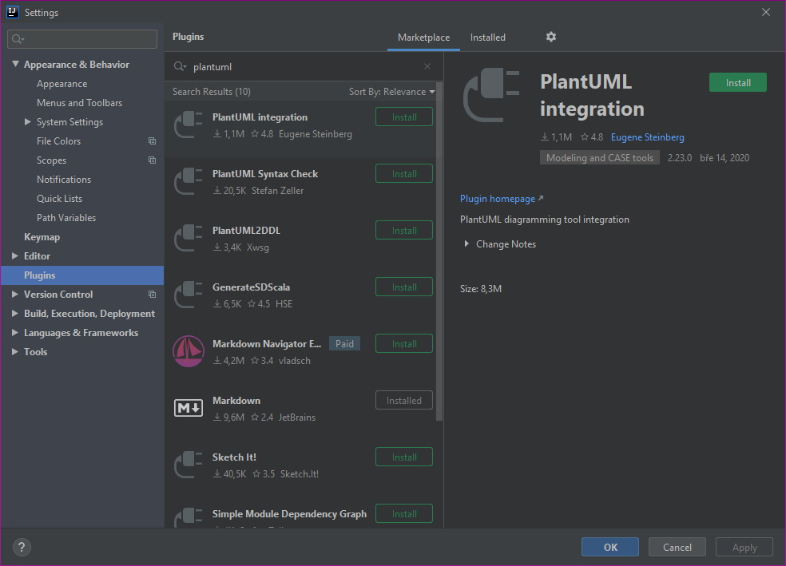
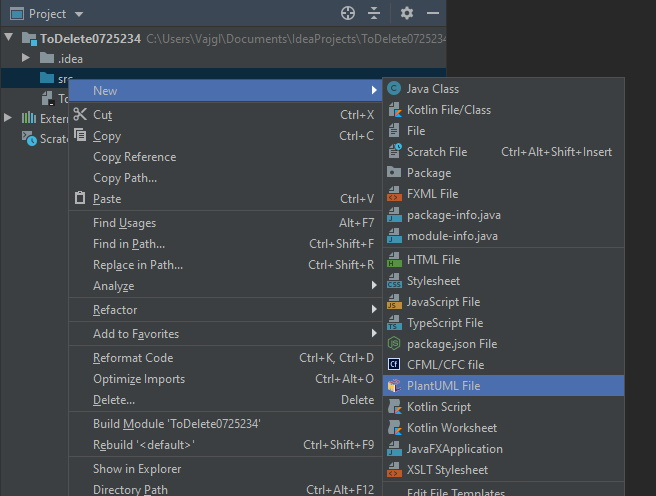

# PlantUML to IntelliJ IDEA

## 1. Prepare IDEA

Open IDE. Select _File -&gt; Settings_ and find "Plugins". Switch to "Marketplace" and find "PlantUML". Install the plugin and restart IDEa.



## 2. Install GraphViz

GraphViz is required by PlantUML.

Download GraphViz from the download page \(currently at [https://graphviz.gitlab.io/download/](https://graphviz.gitlab.io/download/)\). E.g., for windows, download the windows ZIP package and extract it to some location. If you do not use default locations, you will need to set up the PATH variable \(see the tutorial at [https://plantuml.com/graphviz-dot](https://plantuml.com/graphviz-dot)\). For Windows, default 'dot.exe' locations are:

```text
c:\Program Files\Graphviz*\bin\dot.exe
c:\Program Files (x86)\Graphviz*\bin\dot.exe
```

**Ensure twice that the file is at the correct location**.

## 3. Test the installation


Note the IDEA must be restarted to apply plugin changes.


Create an empty project. Select a folder where to place a new diagram and via context menu, choose "New" -&gt; "PlantUml file".



Choose the class diagram \(or any other type\), set the file name, and confirm the dialog.

The diagram should be shown and rendered correctly.

## Bonus: Ctrl+Enter redraw keyboard shortcut

In Settings there is a new item \(at the end of the list on the left side of the Settings window\) PlantUML with plant-uml settings. Here, autodraw interval can be adjusted.

In Settings -&gt;  Keymap search for PlantUml - the item is named "Update PlantUml diagrams". Here assign Ctrl+Enter keyboard shortcut.

