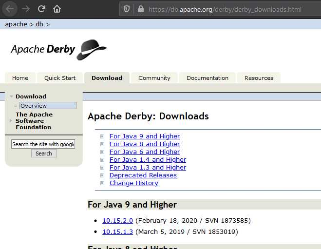
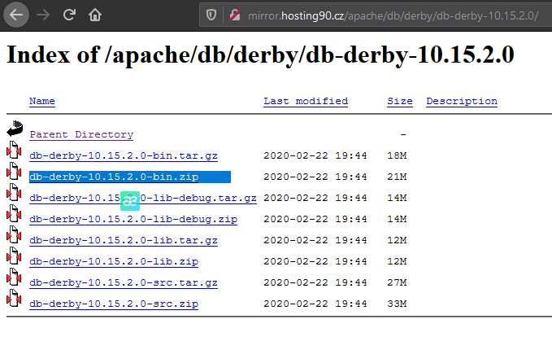
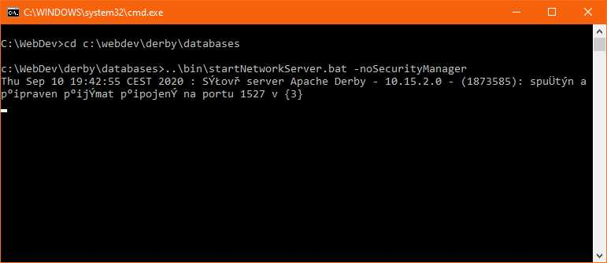
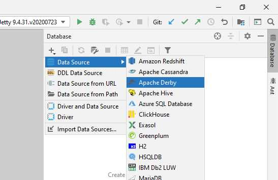
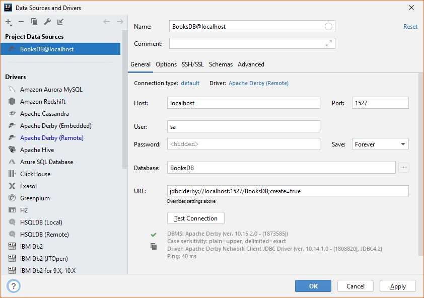
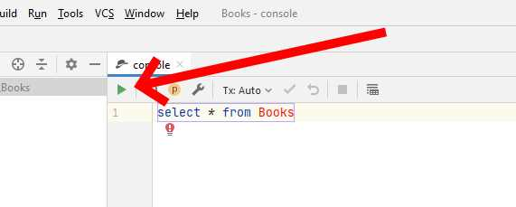

# Instalace serveru Apache Derby

## 1 Stažení a instalace Apache Derby

Otevřeme stránku výrobce [https://db.apache.org/derby/derby\_downloads.html](https://db.apache.org/derby/derby_downloads.html), vybereme vhodnou verzi podle verzi Javy a našeho prostředí.


Idea nativně podporuje Apache Derby do verze 10.14, ale ani s verzí 10.15 nebyly při použití problémy \(k datu 10. 9. 2020\).


Na otevřené stránce pokračujeme ke stažení. Aktuálni verze stránek nabídne k dispozici několik HTTP a FTP serverů. Vybereme libovolný a otevře se nabídka všech produktů ke stažení. V listu hledáme položku "DB =&gt; Derby =&gt; \(požadovaná verze\) &gt; \(požadovaný soubor\)". Pro Windows hledáme soubor ve formátu `db-derby-<verze>-bin.zip`.  Soubor ZIP stáhneme a rozbalíme. Rozbalený obsah umístíme na vhodnou cestu, v našem případě na `C:\WebDev\Derby`.

## 2 Spuštění serveru Apache Derby

### 2.1 Vytvoření složky pro databáze

Aby v obsahu složky nebyl zmatek, vytvoříme ve složce `C:\WebDev\Derby`podsložku `databases`pro databáze.

### 2.2 Spuštění serveru

Spuštění serveru je vhodné z příkazové řádky:

1. Spustíme příkazový řádek.
2. Zadáme do něj příkaz na cestu k požadované složce `cd C:\WebDev\Derby`.
3. Přejdeme na požadované umístění databáze `cd databases`.
4. Zadáme příkaz na spuštění serveru `..\bin\startNetworkServer.bat -noSecurityManager`.
5. Vypíše se informace o úspěšném spuštění serveru.


Pokud nechcete pořád složitě spouštět server z příkazové řádky, můžete využít spuštění přes dávkový soubor:

1. Ve složce `C:\WebDev` vytvořte soubor `start_derby.txt`. 
2. Do souboru zadejte příkazy `cd C:\WebDev\Derby\databases & ..\bin\startNetworkServer.bat -noSecurityManager`
3. Soubor uložte.
4. Přejmenujte jej na `start_derby.bat`.

Po spuštění souboru dvojklikem by se měl spustit server Apache Derby stejně, jako v předchozím postupu.


## 3 Správa derby z prostředí Idea

### 3.1 Připojení serveru/databáze do prostředí Idea

Se serverem lze pracovat z  prostředí Idea pomocí SQL příkazů. Nejdříve je však třeba do projektu připojit server/databázi jako datový zdroj.

Spustíme Ideu a otevřeme nějaký projekt - ideálně ten, ve kterém se bude SQL databáze využívat. Na pravé straně okna vybereme volbu "Database". Rozbalíme a pokračujeme skrz menu "+ =&gt; Data Source =&gt; Apache Derby" k otevření připojovacího dialogu.

V dialogu:

1. \(Volitelné\) V záhlaví lze doplnit vhodný název a případný komentář.
2. Změníme typ připojení/ovladače z "Driver : Apache Derby \(Embedded\)" na "Driver: Apache Derby \(Remote\)". Dialog se změní a nabídne nám více informací k připojení serveru.
3. \(Volitelné\) Pokud se dole v okně objevuje informace "Download missing driver files", stáhneme klikem na "Download" ovladače.

Následně vyplníme připojení k databázi.

<table>
  <thead>
    <tr>
      <th style="text-align:left">Vlastnost</th>
      <th style="text-align:left">Hodnota</th>
      <th style="text-align:left">Popis</th>
    </tr>
  </thead>
  <tbody>
    <tr>
      <td style="text-align:left">Host</td>
      <td style="text-align:left">localhost</td>
      <td style="text-align:left">Po&#x10D;&#xED;ta&#x10D;, na kter&#xE9;m server b&#x11B;&#x17E;&#xED;.</td>
    </tr>
    <tr>
      <td style="text-align:left">Port</td>
      <td style="text-align:left">1527</td>
      <td style="text-align:left">
        
Port, na kter&#xE9;m je server spu&#x161;t&#x11B;n

        
(viz v&#xFD;pis po spu&#x161;t&#x11B;n&#xED; serveru)

      </td>
    </tr>
    <tr>
      <td style="text-align:left">User</td>
      <td style="text-align:left">sa</td>
      <td style="text-align:left">
        
Jm&#xE9;no u&#x17E;ivatele pro p&#x159;ipojen&#xED; k datab&#xE1;zi.

        
Obecn&#x11B; m&#x16F;&#x17E;e b&#xFD;t cokoliv.

      </td>
    </tr>
    <tr>
      <td style="text-align:left">Password</td>
      <td style="text-align:left">********....</td>
      <td style="text-align:left">
        
Heslo pro p&#x159;ipojen&#xED; k datab&#xE1;zi.

        
Obecn&#x11B; m&#x16F;&#x17E;e b&#xFD;t cokoliv.

      </td>
    </tr>
    <tr>
      <td style="text-align:left">Save</td>
      <td style="text-align:left">Forever</td>
      <td style="text-align:left">Zda a jak dlouho m&#xE1; Idea ulo&#x17E;it
         toto p&#x159;ipojen&#xED; do projektu.</td>
    </tr>
    <tr>
      <td style="text-align:left">Database</td>
      <td style="text-align:left">BooksDB</td>
      <td style="text-align:left">N&#xE1;zev datab&#xE1;ze, ke kter&#xE9; se p&#x159;ipojujeme.</td>
    </tr>
  </tbody>
</table>

Podle zadaných hodnot se mění hodnota pole `URL`. Toto pole se používá pro připojení k databázi jako tzv. _connection string_.


Protože pro první připojení databáze nejspíš neexistuje, do url dopíšeme ručně `;create=true`. Tento příkaz se postará o to, aby se při prvním připojení databáze vytvořila, pokud ještě neexistuje. Po úspěšném připojení lze tento dodatek smazat.



Volba jména a hesla je důležitá. V případě ztráty jména či hesla je typicky nemožné vygenerovat jméno či heslo nové a přístup k databázi je tak ztracen!


Poté zvolíme tlačítko "Test Connection". Databáze by měla vypsat úspěšné připojení. \(Předpokládáme, že databázový server je spuštěn - viz výše\).

Po potvrzení dialogu se do Idea uloží databáze jako datový zdroj a také se otevře nové okno `console`pro zadávání SQL příkazů pro databázi.

### 3.2 Práce s databází v Idea

Databáze připojená jako datový zdroj se zobrazuje v okně datových zdrojů - záložka "Database" vpravo nahoře v Idea. Po rozbalení lze přes kontextové menu vybrat "Open query console", což otevře okno pro zadávání SQL dotazů.

Jednotlivé SQL dotazy se vykonávají postupně, s využitím zelené šipky u okna konzole. Lze zadávat libovolné SQL příkazy v dialektu dané databáze.

