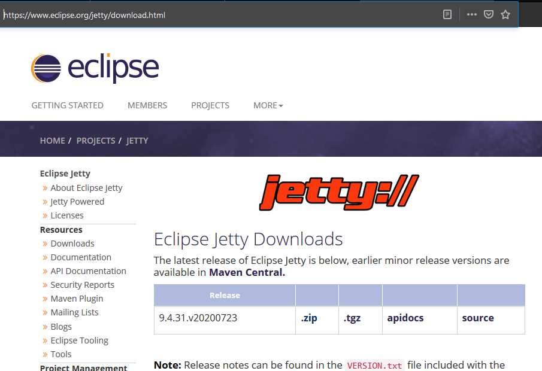

# Instalace serveru Jetty

## 1 Instalace serveru

Server stáhneme z webových stránek výrobce [https://www.eclipse.org/jetty/download.html](https://www.eclipse.org/jetty/download.html) ve vhodné verzi pro náš počítač. Předpokládáme systém Windows, tedy stahujeme ZIP soubor. Uložíme jej na disk, rozbalíme a obsah vložíme do vhodné složky. Na výslednou cestu budeme obsahovat jako na cestu k serveru, například: `C:\WebDev\Jetty`.

## 2 Vložení do prostředí Idea

Spustíme prostředí Idea. Otevřeme nastavení přes menu "File =&gt; Settings". Najdeme položku "Build, Execution, Deployment =&gt; Application Servers".

V otevřené nabíce zvolíme "+", vybereme "Jetty server" a vložíme cestu ke složce se serverem \(viz výše\). 

Dialog potvrdíme a ukončíme.

